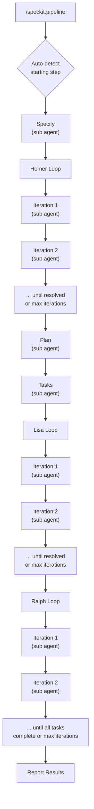
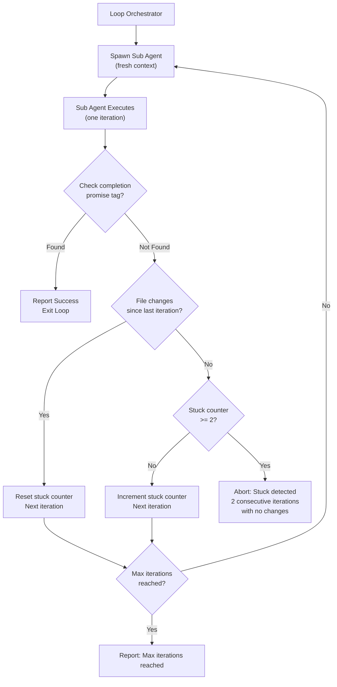

# Simpsons Loops for Speckit

Automated iteration loops and pipeline orchestration for [Speckit](https://github.com/speckit)-powered projects using the Claude CLI.

Each loop spawns fresh sub agents (via the Agent tool) with isolated context windows per iteration, preventing hallucination drift and context window exhaustion.

| Loop | What it does |
| --- | --- |
| Homer | Iterative spec clarification. Runs `/speckit.clarify` on `spec.md`, resolves the highest-severity ambiguity, commits, and repeats until zero findings remain. |
| Lisa | Iterative cross-artifact analysis. Runs `/speckit.analyze` on `spec.md`, `plan.md`, and `tasks.md`, fixes the highest-severity finding, commits, and repeats until zero findings remain. |
| Ralph | Task-by-task implementation. Picks the next incomplete task from `tasks.md`, implements it, validates against quality gates, commits, and repeats until all tasks are done. |
| Pipeline | End-to-end orchestrator: homer -> plan -> tasks -> lisa -> ralph. Auto-detects where to start based on existing artifacts. |

> **Note on permissions**
> The loop commands instruct sub agents to execute autonomously — no permission prompts, no confirmation dialogs, no interactive pauses. Review the agent files and understand what each loop does before running them.

## Architecture

### Pipeline flow

The pipeline orchestrator spawns a fresh sub agent (via the Agent tool) for each step and each loop iteration. Steps execute strictly in sequence — each sub agent must complete before the next is spawned.



### Standalone loop iteration lifecycle

Each standalone loop command (`/speckit.homer.clarify`, `/speckit.lisa.analyze`, `/speckit.ralph.implement`) follows the same iteration lifecycle.



## Recommended workflow

Before kicking off the pipeline or any loop, refine your specs manually. Run `/speckit.specify` to draft the initial spec, then use `/speckit.clarify` interactively to resolve ambiguities. The more precise your spec is before automation takes over, the better the results — automation amplifies whatever it's given.

You can also run each loop individually and review between stages instead of running the full pipeline. Run Homer first, review the clarified spec, generate the plan and tasks manually, review those, run Lisa, review, then run Ralph. This staged approach lets you course-correct at every step.

## API key vs. Claude subscription

If `ANTHROPIC_API_KEY` is set, every iteration will consume API credits from that key. To use your **Claude subscription** (Pro/Max) instead:

```bash
unset ANTHROPIC_API_KEY
```

## Prerequisites

- A project already set up with Speckit (`.specify/` directory exists)
- [Claude CLI](https://docs.anthropic.com/en/docs/claude-code) installed
- Existing Speckit commands in `.claude/commands/` (at minimum: `speckit.implement.md`, `speckit.analyze.md`, `speckit.clarify.md`, `speckit.plan.md`, `speckit.tasks.md`)

## Setup

### Option A: Automated (recommended)

From the root of your target project:

```bash
bash <path-to-simpsons-loops>/setup.sh
```

This copies agent definitions and loop command files into `.claude/agents/` and `.claude/commands/`, creates a placeholder `.specify/quality-gates.sh` if one does not exist, appends `.gitignore` entries, and cleans up any previously-installed bash loop scripts and their permissions.

### Option B: Manual

<details>
<summary>Click to expand manual steps</summary>

#### 1. Copy files into your project

From the root of your project:

```bash
# Agent definitions -> .claude/agents/
cp <path-to-simpsons-loops>/claude-agents/homer.md  .claude/agents/homer.md
cp <path-to-simpsons-loops>/claude-agents/lisa.md   .claude/agents/lisa.md
cp <path-to-simpsons-loops>/claude-agents/ralph.md  .claude/agents/ralph.md
cp <path-to-simpsons-loops>/claude-agents/plan.md   .claude/agents/plan.md
cp <path-to-simpsons-loops>/claude-agents/tasks.md  .claude/agents/tasks.md
cp <path-to-simpsons-loops>/claude-agents/specify.md .claude/agents/specify.md

# Loop commands -> .claude/commands/
cp <path-to-simpsons-loops>/speckit-commands/speckit.ralph.implement.md   .claude/commands/speckit.ralph.implement.md
cp <path-to-simpsons-loops>/speckit-commands/speckit.lisa.analyze.md      .claude/commands/speckit.lisa.analyze.md
cp <path-to-simpsons-loops>/speckit-commands/speckit.homer.clarify.md     .claude/commands/speckit.homer.clarify.md
cp <path-to-simpsons-loops>/speckit-commands/speckit.pipeline.md          .claude/commands/speckit.pipeline.md
```

#### 2. Update `.gitignore`

```gitignore
# Simpsons loops - generated at runtime

*.ralph-prompt.md*
*.ralph-prev-output*    # Stuck detection state
*.ralph-state*          # Resumption state

# Lisa loop temp files
*.lisa-prompt.md*
*.lisa-prev-output*
*.lisa-state*

# Homer loop temp files
*.homer-prompt.md*
*.homer-prev-output*
*.homer-state*

.specify/logs/          # All log files
```

#### 3. Create quality gates file

Create `.specify/quality-gates.sh` with your project's quality gate commands:

```bash
# Example for a Node.js project:
npm test && npm run lint

# Example for a Python project:
pytest && ruff check .

# Example for a shell script project:
shellcheck *.sh
```

The file must exit 0 for quality gates to pass. This file is required for the Ralph loop to validate implementation work.

</details>

## Usage

Each loop has a corresponding slash command that orchestrates iterations using the **Agent tool** (sub agents) directly within your session. Each iteration gets a fresh context window.

### Homer (clarification)

After running `/speckit.specify` to create `spec.md`:

```
/speckit.homer.clarify
```

Homer only requires `spec.md` to exist — it does not need `plan.md` or `tasks.md`. This means you can run Homer immediately after creating your spec.

### Lisa (analysis)

Once you have `spec.md`, `plan.md`, and `tasks.md`:

```
/speckit.lisa.analyze
```

### Ralph (implementation)

Once you have `tasks.md` from `/speckit.tasks`:

```
/speckit.ralph.implement
```

Ralph validates that `.specify/quality-gates.sh` exists and contains executable content before starting. If the file is missing or empty, Ralph aborts with a clear error.

### Pipeline (end-to-end)

After creating a spec with `/speckit.specify`, run the full pipeline:

```
/speckit.pipeline
```

Or target a specific spec directory:

```
/speckit.pipeline specs/a1b2-feat-user-auth
```

Or resume from a specific step:

```
/speckit.pipeline --from ralph specs/a1b2-feat-user-auth
```

**Stop-after menu:** When running interactively, the pipeline presents a menu asking how far to run:

```
How far should the pipeline run?
  a) All the way through (homer -> plan -> tasks -> lisa -> ralph)
  b) Stop after homer loop
  c) Stop after plan
  d) Stop after tasks
  e) Stop after lisa loop
  (default: a)
```

Pick a letter and press Enter (or just Enter for the full pipeline). This works alongside `--from` — you can start from any step and stop at any later step.

**Smart auto-detection:** If `--from` is not specified, the pipeline inspects existing artifacts and starts from the right step:

- `tasks.md` with some tasks completed -> **ralph**
- `tasks.md` with no tasks started -> **lisa**
- `plan.md` exists -> **tasks**
- `spec.md` exists -> **homer**

**Resuming after interruption:** All work is committed after each iteration, so you can safely stop and resume.

## How the loops work

**Completion detection** — Each loop looks for promise tags in the output:

- Homer / Lisa: `<promise>ALL_FINDINGS_RESOLVED</promise>`
- Ralph: `<promise>ALL_TASKS_COMPLETE</promise>`

**Stuck detection** — If two consecutive iterations produce no file changes and no completion signal, the loop aborts to avoid infinite cycling.

**Logging** — All iterations are logged to `.specify/logs/` with timestamps (e.g. `ralph-20260218-130522.log`).

## Customization

### Quality gates (Ralph)

Quality gates are defined in a single file: `.specify/quality-gates.sh`. This is the sole source of quality gate configuration — there are no CLI arguments or environment variable overrides.

Ralph validates this file before starting:
- The file must exist at `.specify/quality-gates.sh`
- The file must contain at least one non-comment, non-whitespace line
- The file must exit 0 for quality gates to pass

Example for a shell script project:

```bash
shellcheck *.sh
```

Example for a Node.js project:

```bash
npm test && npm run lint
```

### Dogfooding

This project uses itself to build itself — simpsons-loops builds simpsons-loops. The shellcheck quality gate ensures that every Ralph implementation iteration produces clean, lint-free shell scripts before committing.

### Max iterations

| Loop  | Default                     |
| ----- | --------------------------- |
| Homer | 30                          |
| Lisa  | 30                          |
| Ralph | incomplete tasks + 10       |

All loops accept an optional numeric argument to override the default max iterations (e.g., `/speckit.homer.clarify 5`).

## References

- [Speckit Ralph Loop: Fresh Context AI Development](https://dominic-boettger.com/blog/speckit-ralph-loop-fresh-context-ai-development/)
