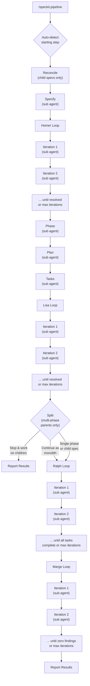
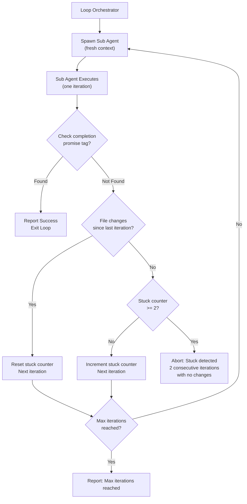

# Simpsons Loops for Speckit

> ⚠️ _Alpha — Experimental Project_
> This project is in early alpha and under active, rapid development. Expect frequent breaking changes, shifting APIs, and structural overhauls. Things will change often and without notice. Use at your own risk.

Automated iteration loops and pipeline orchestration for [Speckit](https://github.com/speckit)-powered projects using Claude Code CLI.

Each loop spawns fresh sub agents (via the Agent tool) with isolated context windows per iteration, preventing hallucination drift and context window exhaustion.

| Loop     | What it does                                                                                                                                                                                        |
| -------- | --------------------------------------------------------------------------------------------------------------------------------------------------------------------------------------------------- |
| Homer    | Iterative spec clarification. Runs `/speckit.clarify` on `spec.md`, resolves the highest-severity ambiguity, commits, and repeats until zero findings remain.                                       |
| Lisa     | Iterative cross-artifact analysis. Runs `/speckit.analyze` on `spec.md`, `plan.md`, and `tasks.md`, fixes the highest-severity finding, commits, and repeats until zero findings remain.            |
| Ralph    | Task-by-task implementation. Picks the next incomplete task from `tasks.md`, implements it, validates against quality gates, commits, and repeats until all tasks are done.                         |
| Marge    | Iterative code review. Runs `/speckit.review` on the feature branch diff, fixes the highest-severity mechanical finding (leaves `NEEDS_HUMAN` for humans), commits, and repeats until none remain. |
| Pipeline | End-to-end orchestrator: reconcile -> specify -> homer -> phase -> plan -> tasks -> lisa -> split -> ralph -> marge. Auto-detects where to start based on existing artifacts.                       |

**Pre-pipeline:**

| Command     | What it does                                                                                                                                                                                        |
| ----------- | --------------------------------------------------------------------------------------------------------------------------------------------------------------------------------------------------- |
| Brainstorm  | Adversarial idea refinement. Challenges a vague idea with 4-7 targeted questions, then emits a feature description ready for `/speckit.specify` or `/speckit.pipeline --description "..."`.         |

> **Note on permissions**
> The loop commands instruct sub agents to execute autonomously — no permission prompts, no confirmation dialogs, no interactive pauses. Review the agent files and understand what each loop does before running them.

## Architecture

### Pipeline flow

The pipeline orchestrator spawns a fresh sub agent (via the Agent tool) for each step and each loop iteration. Steps execute strictly in sequence — each sub agent must complete before the next is spawned.



### Standalone loop iteration lifecycle

Each standalone loop command (`/speckit.homer.clarify`, `/speckit.lisa.analyze`, `/speckit.ralph.implement`, `/speckit.marge.review`) follows the same iteration lifecycle.



## Recommended workflow

Before kicking off the pipeline or any loop, refine your specs manually. Start with `/speckit.brainstorm` if your idea is still vague — it will challenge you to sharpen it. Then run `/speckit.specify` to draft the initial spec, and `/speckit.clarify` interactively to resolve ambiguities. The more precise your spec is before automation takes over, the better the results — automation amplifies whatever it's given.

You can also run each loop individually and review between stages instead of running the full pipeline. Run Homer first, review the clarified spec, generate the plan and tasks manually, review those, run Lisa, review, then run Ralph. This staged approach lets you course-correct at every step.

### Large features: phased delivery

When a feature is too large to implement and deploy as a single unit — database migrations that need expand-and-contract sequencing, third-party integrations that need production validation, or changes that would produce unreviewable PRs — use phased delivery:

1. **Run the pipeline** — `/speckit.pipeline --from specify --description "..."` runs specify, homer (clarify), phase (detect deployment boundaries), plan, tasks, and lisa (cross-artifact analysis) on the parent spec. Phase detection uses vertical-slice grouping by product surface — each surface completes its full deploy cycle before the next starts.

2. **Auto-split** — After lisa, the pipeline's split step detects multi-phase specs and generates child spec directories under `specs/`, one per phase, using a `{parent}--p{N}-{slug}` naming convention. It then prompts you: stop and work on children (recommended) or continue as a monolith.

3. **Implement phase by phase** — Run `/speckit.pipeline` on each child spec in order. The pipeline enforces phase ordering: phase N cannot start until all earlier phases are marked "Complete" in the parent manifest. Use `--skip-phase-guard` to bypass this when phases are independent.

4. **Auto-status** — The pipeline automatically updates the parent manifest as work progresses. When a child pipeline starts, the phase is marked "In Progress". When Marge (code review) completes successfully, the phase is marked "Complete". After each update, a phase status summary is printed so you can see progress across all phases at a glance.

5. **Auto-reconcile** — When you pipeline a child spec (phase 2+), the reconcile step automatically syncs it with what earlier phases actually built. No manual reconciliation needed — each child pipeline is self-healing.

## API key vs. Claude subscription

If `ANTHROPIC_API_KEY` is set, every iteration will consume API credits from that key. To use your **Claude subscription** (Pro/Max) instead:

```bash
unset ANTHROPIC_API_KEY
```

## Prerequisites

- A project already set up with Speckit (`.specify/` directory exists)
- [Claude CLI](https://docs.anthropic.com/en/docs/claude-code) installed
- Existing Speckit commands in `.claude/commands/` (at minimum: `speckit.specify.md`, `speckit.implement.md`, `speckit.analyze.md`, `speckit.clarify.md`, `speckit.plan.md`, `speckit.tasks.md`). Marge's review loop additionally relies on `speckit.review.md`, and the splitting skill relies on `speckit.split.md` — both are installed by `setup.sh`.

## Setup

### Option A: Automated (recommended)

From the root of your target project:

```bash
bash <path-to-simpsons-loops>/setup.sh
```

This deploys CLAUDE.md and constitution.md templates, copies agent definitions and loop command files into `.claude/agents/` and `.claude/commands/`, seeds Marge's baseline review packs into `.specify/marge/checks/` (idempotent — existing pack files are preserved), creates a placeholder `.specify/quality-gates.sh` if one does not exist, appends `.gitignore` entries, and cleans up any previously-installed bash loop scripts and their permissions.

### Option B: Manual

<details>
<summary>Click to expand manual steps</summary>

#### 1. Copy files into your project

From the root of your project:

```bash
# Agent definitions -> .claude/agents/
cp <path-to-simpsons-loops>/claude-agents/homer.md  .claude/agents/homer.md
cp <path-to-simpsons-loops>/claude-agents/lisa.md   .claude/agents/lisa.md
cp <path-to-simpsons-loops>/claude-agents/marge.md  .claude/agents/marge.md
cp <path-to-simpsons-loops>/claude-agents/ralph.md  .claude/agents/ralph.md
cp <path-to-simpsons-loops>/claude-agents/plan.md   .claude/agents/plan.md
cp <path-to-simpsons-loops>/claude-agents/tasks.md  .claude/agents/tasks.md
cp <path-to-simpsons-loops>/claude-agents/specify.md .claude/agents/specify.md
cp <path-to-simpsons-loops>/claude-agents/phase.md       .claude/agents/phase.md
cp <path-to-simpsons-loops>/claude-agents/split.md      .claude/agents/split.md
cp <path-to-simpsons-loops>/claude-agents/reconcile.md  .claude/agents/reconcile.md

# Loop commands -> .claude/commands/
cp <path-to-simpsons-loops>/speckit-commands/speckit.ralph.implement.md   .claude/commands/speckit.ralph.implement.md
cp <path-to-simpsons-loops>/speckit-commands/speckit.lisa.analyze.md      .claude/commands/speckit.lisa.analyze.md
cp <path-to-simpsons-loops>/speckit-commands/speckit.homer.clarify.md     .claude/commands/speckit.homer.clarify.md
cp <path-to-simpsons-loops>/speckit-commands/speckit.marge.review.md      .claude/commands/speckit.marge.review.md
cp <path-to-simpsons-loops>/speckit-commands/speckit.review.md            .claude/commands/speckit.review.md
cp <path-to-simpsons-loops>/speckit-commands/speckit.pipeline.md          .claude/commands/speckit.pipeline.md
cp <path-to-simpsons-loops>/speckit-commands/speckit.brainstorm.md       .claude/commands/speckit.brainstorm.md
cp <path-to-simpsons-loops>/speckit-commands/speckit.review.pr.md       .claude/commands/speckit.review.pr.md
cp <path-to-simpsons-loops>/speckit-commands/speckit.phase.md         .claude/commands/speckit.phase.md
cp <path-to-simpsons-loops>/speckit-commands/speckit.split.md          .claude/commands/speckit.split.md

# Marge review packs -> .specify/marge/checks/
mkdir -p .specify/marge/checks
cp -n <path-to-simpsons-loops>/.specify/marge/checks/*.md .specify/marge/checks/
```

#### 2. Update `.gitignore`

```gitignore
# Simpsons loops - generated at runtime

*.ralph-prompt.md*
*.ralph-prev-output*    # Stuck detection state
*.ralph-state*          # Resumption state

# Lisa loop temp files
*.lisa-prompt.md*
*.lisa-prev-output*
*.lisa-state*

# Homer loop temp files
*.homer-prompt.md*
*.homer-prev-output*
*.homer-state*

# Marge loop temp files
*.marge-prompt.md*
*.marge-prev-output*
*.marge-state*

.specify/logs/          # All log files
```

#### 3. Create quality gates file

Create `.specify/quality-gates.sh` with your project's quality gate commands:

```bash
# Example for a Node.js project:
npm test && npm run lint

# Example for a Python project:
pytest && ruff check .

# Example for a shell script project:
shellcheck *.sh
```

The file must exit 0 for quality gates to pass. This file is required for the Ralph loop to validate implementation work.

</details>

## Usage

Each loop has a corresponding slash command that orchestrates iterations using the **Agent tool** (sub agents) directly within your session. Each iteration gets a fresh context window.

### Brainstorm (pre-spec)

Sharpen a vague idea before writing a spec:

```
/speckit.brainstorm I want to add some kind of caching layer
```

Asks 4-7 targeted questions that challenge your assumptions, then produces a feature description ready for `/speckit.specify` or `/speckit.pipeline --description "..."`.

### Homer (clarification)

After running `/speckit.specify` to create `spec.md`:

```
/speckit.homer.clarify
```

Homer only requires `spec.md` to exist — it does not need `plan.md` or `tasks.md`. This means you can run Homer immediately after creating your spec.

### Lisa (analysis)

Once you have `spec.md`, `plan.md`, and `tasks.md`:

```
/speckit.lisa.analyze
```

### Ralph (implementation)

Once you have `tasks.md` from `/speckit.tasks`:

```
/speckit.ralph.implement
```

Ralph validates that `.specify/quality-gates.sh` exists and contains executable content before starting. If the file is missing or empty, Ralph aborts with a clear error.

### Marge (code review)

After Ralph has implemented the feature:

```
/speckit.marge.review
```

Marge reviews the feature branch's diff against baseline and project-specific review packs in `.specify/marge/checks/`, fixes the highest-severity mechanical finding per iteration, and loops until all findings are resolved or every remaining finding is flagged `NEEDS_HUMAN`. Findings that require design judgment are left for a human reviewer.

For a single-pass report (no auto-fix), run `/speckit.review` instead.

### PR Review (human-judgment findings)

After Marge finishes (or independently on any branch with an open PR), post inline comments for findings that need human attention:

```
/speckit.review.pr
```

Or target a specific PR:

```
/speckit.review.pr pr:42
```

Or preview findings without posting:

```
/speckit.review.pr --dry-run
```

Posts a GitHub PR review with inline comments for one-way doors (CRITICAL), concurrency risks (WARNING), architectural decisions (WARNING), and project-specific patterns (INFO). Uses `COMMENT` event type — informational, not a merge gate. Idempotent: won't double-post on the same commit.

When the pipeline runs and an open PR exists, this step runs automatically after Marge.

### Split and Reconcile (pipeline steps)

**Split** runs automatically in the pipeline after lisa for multi-phase parent specs. It generates child spec directories:

```
specs/
  c31c-feat-billing-overhaul/                      # parent spec (with manifest)
  c31c-feat-billing-overhaul--p1-expand-schema/    # phase 1 child
  c31c-feat-billing-overhaul--p2-integration/      # phase 2 child
  c31c-feat-billing-overhaul--p3-ui-reveal/        # phase 3 child
```

After splitting, the pipeline prompts: stop and work on children (recommended) or continue as a monolith. You can also run `/speckit.split` standalone on any phase-annotated parent spec.

**Reconcile** runs automatically at the start of a child spec's pipeline (phase 2+). It syncs the child spec with what earlier sibling phases actually built, so you always pick up from reality rather than the original plan.

Re-running split is idempotent. It detects manual edits, propagates changes from earlier phases, and flags conflicts with `<!-- CONFLICT: ... -->` markers.

Phase status follows a forward-only state machine: Draft -> In Progress -> Complete, with Cancelled available from any active state.

### Pipeline (end-to-end)

After creating a spec with `/speckit.specify`, run the full pipeline:

```
/speckit.pipeline
```

Or target a specific spec directory:

```
/speckit.pipeline specs/a1b2-feat-user-auth
```

Or resume from a specific step:

```
/speckit.pipeline --from ralph specs/a1b2-feat-user-auth
```

Or stop the pipeline after a specific step completes:

```
/speckit.pipeline --stop-after plan
```

Or bootstrap end-to-end from a feature description:

```
/speckit.pipeline --from specify --description "Add user authentication with OAuth2"
```

`--from`, `--stop-after`, and `--description` can be combined. For example, run homer through tasks only:

```
/speckit.pipeline --from homer --stop-after tasks specs/a1b2-feat-user-auth
```

**Smart auto-detection:** If `--from` is not specified, the pipeline inspects existing artifacts and starts from the right step:

- Child spec (phase 2+) with no `plan.md` -> **reconcile**
- No `spec.md` but `--description` provided -> **specify**
- `spec.md` exists, no populated Phases -> **homer**
- `spec.md` exists with populated Phases, no `plan.md` -> **plan**
- `plan.md` exists -> **tasks**
- `tasks.md` with no tasks started -> **lisa**
- `spec.md` with Phases and `## Manifest` section -> **ralph** (split already ran)
- `tasks.md` with some tasks completed -> **ralph**
- `tasks.md` with all tasks completed (no `- [ ]` remaining) -> **marge**

**`--stop-after <step>`:** Halts the pipeline after the specified step completes, skipping all subsequent steps. Valid values: `reconcile`, `specify`, `homer`, `phase`, `plan`, `tasks`, `lisa`, `split`, `ralph`, `marge`. The step must come at or after the starting step in the pipeline sequence.

**`--description <text>`:** Provides a feature description for the specify step. Required when using `--from specify`. Enables bootstrapping a new feature end-to-end from a single command.

**`--skip-phase-guard`:** Bypasses the phase order guard for child specs. By default, phase N blocks unless all earlier phases (1..N-1) are "Complete" in the parent manifest. Use this flag when phases are independent or when earlier phases were intentionally cancelled.

**Resuming after interruption:** All work is committed after each iteration, so you can safely stop and resume.

## How the loops work

**Completion detection** — Each loop looks for promise tags in the output:

- Homer / Lisa / Marge: `<promise>ALL_FINDINGS_RESOLVED</promise>`
- Ralph: `<promise>ALL_TASKS_COMPLETE</promise>`

**Stuck detection** — If two consecutive iterations produce no file changes and no completion signal, the loop aborts to avoid infinite cycling.

**Logging** — All iterations are logged to `.specify/logs/` with timestamps (e.g. `ralph-20260218-130522.log`).

## Customization

### Quality gates (Ralph)

Quality gates are defined in a single file: `.specify/quality-gates.sh`. This is the sole source of quality gate configuration — there are no CLI arguments or environment variable overrides.

Ralph validates this file before starting:

- The file must exist at `.specify/quality-gates.sh`
- The file must contain at least one non-comment, non-whitespace line
- The file must exit 0 for quality gates to pass

Example for a shell script project:

```bash
shellcheck *.sh
```

Example for a Node.js project:

```bash
npm test && npm run lint
```

### Dogfooding

This project uses itself to build itself — simpsons-loops builds simpsons-loops. The shellcheck quality gate ensures that every Ralph implementation iteration produces clean, lint-free shell scripts before committing.

### Max iterations

| Loop  | Default               |
| ----- | --------------------- |
| Homer | 30                    |
| Lisa  | 30                    |
| Ralph | incomplete tasks + 10 |
| Marge | 30                    |

All loops accept an optional numeric argument to override the default max iterations (e.g., `/speckit.homer.clarify 5`).

### Marge review packs

Marge's review rules live in `.specify/marge/checks/` as plain markdown files. `setup.sh` seeds four baseline packs:

- `generic-bugs.md` — null handling, off-by-one, race conditions, wrong-argument-order, swallowed exceptions
- `security.md` — OWASP essentials: secrets, SQLi, command injection, authz, crypto misuse, PII in logs
- `testing.md` — test-first discipline, coverage for new public functions, fixture hygiene, flaky patterns
- `architecture.md` — scope creep, duplicated helpers, dead code, layer violations, broken invariants

Add project-specific packs by dropping additional `*.md` files into the same directory. Marge auto-discovers every `*.md`; the filename is the pack name. Baseline files are preserved on re-install — existing pack files are never overwritten.

## References

- [Speckit Ralph Loop: Fresh Context AI Development](https://dominic-boettger.com/blog/speckit-ralph-loop-fresh-context-ai-development/)
