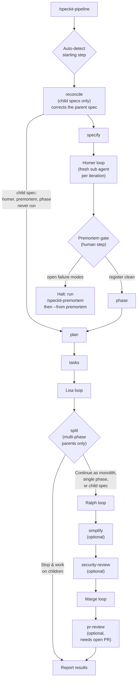
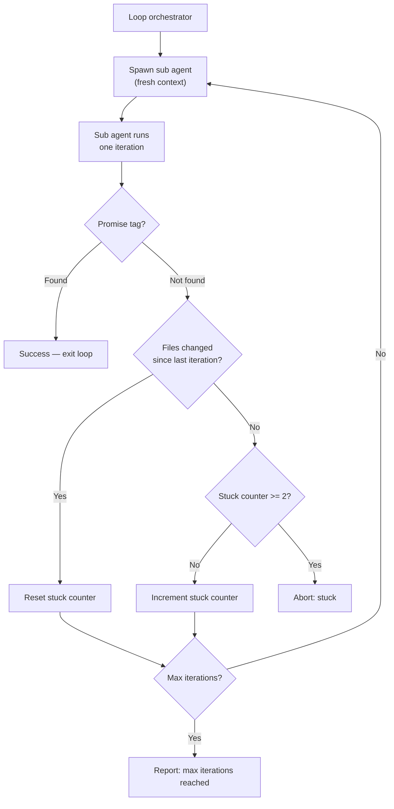

# Simpsons Loops for Speckit

> ⚠️ _Alpha — Experimental Project_
> This project is in early alpha and under active, rapid development. Expect frequent breaking changes, shifting APIs, and structural overhauls. Things will change often and without notice. Use at your own risk.

Automated iteration loops and pipeline orchestration for [Spec Kit](https://github.com/github/spec-kit)-powered projects using Claude Code.

Every loop iteration and every pipeline step runs in a **fresh sub agent** with its own context window. Nothing carries over but the files on disk, which is what keeps long runs from drifting or exhausting context.

## What's in the box

The pipeline runs these steps in order. Every one of them is also runnable on its own — see [Running steps individually](#running-steps-individually) for the slash-command names.

| # | Step | Kind | What it does |
|---|------|------|--------------|
| 0 | **reconcile** | single-shot, child specs only | Compares what completed phases actually shipped against the parent spec and corrects the **parent**. |
| 1 | **specify** | single-shot | Creates `spec.md` from a feature description. |
| 2 | **homer** | loop | Clarifies the spec. Self-answers up to 5 queued questions per iteration using the skill's own recommended answers. Typically 2-3 iterations. |
| 3 | **premortem** | **human gate** | You work three failure-mode lenses (architecture, UX, support/ops) interactively. Mitigations land in `spec.md`; every risk is tracked in `failure-modes.md`. The pipeline **halts here** until nothing is `open`. |
| 4 | **phase** | single-shot | Detects deployment boundaries and writes a `## Phases` section. |
| 5 | **plan** | single-shot | Generates `plan.md`. |
| 6 | **tasks** | single-shot | Generates a dependency-ordered `tasks.md`. |
| 7 | **lisa** | loop | Cross-artifact analysis of spec/plan/tasks. Fixes all auto-fixable findings per iteration, then re-scans to verify. Typically 2-3 iterations. |
| 8 | **split** | single-shot, multi-phase parents only | Generates one child spec directory per phase. |
| 9 | **ralph** | loop | Implements one task per iteration, validates against quality gates, commits. |
| — | **simplify** | optional | Invokes `/simplify` for reuse/quality/efficiency fixes. Silently skipped if the skill is absent. |
| — | **security-review** | optional | Invokes `/security-review` for a security audit. Silently skipped if the skill is absent. |
| 10 | **marge** | loop | Reviews the branch diff against review packs. Fixes all mechanical findings per iteration, leaves `NEEDS_HUMAN` ones alone, re-reviews to verify. Typically 2-3 iterations. |
| — | **pr-review** | optional | Posts inline PR comments for human-judgment findings. Skipped if there is no open PR. |

The three unnumbered steps are **optional polish** — they run automatically when their skill is installed, and they are not valid `--from` / `--stop-after` targets.

Two commands sit outside the pipeline:

| Command | What it does |
|---------|--------------|
| `/speckit-brainstorm` | Pre-spec. Stress-tests a vague idea with pointed questions — one at a time, 4-5 typical, 7 hard cap — then emits a feature description ready for `/speckit-specify` or `--description`. |
| `/speckit-review` | Single-pass code review report, no auto-fix. Marge without the loop. |

> **Note on permissions**
> The loops instruct sub agents to execute autonomously — no permission prompts, no confirmations, no interactive pauses. Read the agent files before running them.
> The one deliberate exception is **premortem**: a human gate the pipeline never runs for you. Risk disposition belongs to a person.

## Pipeline flow


```mermaid
flowchart TD
    A["/speckit-pipeline"] --> B{Auto-detect<br/>starting step}
    B --> R["reconcile<br/>(child specs only)<br/>corrects the parent spec"]
    R -->|"child spec:<br/>homer, premortem, phase<br/>never run"| E
    R --> C["specify"]
    C --> D["Homer loop<br/>(fresh sub agent<br/>per iteration)"]
    D --> PM{"Premortem gate<br/>(human step)"}
    PM -->|"open failure modes"| PMH["Halt: run<br/>/speckit-premortem<br/>then --from premortem"]
    PM -->|"register clean"| P["phase"]
    P --> E["plan"]
    E --> F["tasks"]
    F --> G["Lisa loop"]
    G --> S{"split<br/>(multi-phase<br/>parents only)"}
    S -->|"Stop & work<br/>on children"| Z["Report results"]
    S -->|"Continue as monolith,<br/>single phase,<br/>or child spec"| H["Ralph loop"]
    H --> O1["simplify<br/>(optional)"]
    O1 --> O2["security-review<br/>(optional)"]
    O2 --> M["Marge loop"]
    M --> O3["pr-review<br/>(optional,<br/>needs open PR)"]
    O3 --> Z
```

## Prerequisites

- A project already set up with Spec Kit (a `.specify/` directory exists)
- [Claude Code](https://docs.anthropic.com/en/docs/claude-code) installed
- Upstream Spec Kit commands or skills present: `speckit-specify`, `speckit-plan`, `speckit-tasks`, `speckit-analyze`, `speckit-clarify`, `speckit-implement`

Everything else — the loop skills, `speckit-review`, `speckit-split`, `speckit-reconcile`, `speckit-premortem` — is installed by `setup.sh`.

### API key vs. Claude subscription

If `ANTHROPIC_API_KEY` is set, every iteration consumes API credits from that key. To bill your Claude subscription (Pro/Max) instead:

```bash
unset ANTHROPIC_API_KEY
```

## Setup

From the root of your target project:

```bash
bash <path-to-simpsons-loops>/setup.sh
```

It is idempotent — re-run it to upgrade.

<details>
<summary>What setup.sh installs (and how to do it by hand)</summary>

| Source (this repo) | Destination (your project) | On re-install |
|--------------------|----------------------------|---------------|
| `claude-agents/*.md` | `.claude/agents/` | overwritten |
| `speckit-skills/*/` | `.claude/skills/` | overwritten (each skill is a directory; `reference/` files ride along) |
| `specify-marge/baseline/*.md` | `.specify/marge/baseline/` | **preserved** — your edits survive |
| `specify-marge/README.md`, `config/README.md`, `run-gates.sh` | `.specify/marge/` | overwritten (framework docs + runner) |
| `scripts/speckit-commit.sh` | `.specify/scripts/bash/` | overwritten |
| `templates/CLAUDE.md` | `CLAUDE.md` | merged — content below the separator is yours |
| `templates/constitution.md` | `.specify/memory/constitution.md` | merged — content below the separator is yours |
| `gitignore` | appended to `.gitignore` | skipped if the marker line is present |

It also creates `.specify/quality-gates.sh` and `.specify/quality-gates-fast.sh` placeholders if they do not exist (both exit 1 until you edit them), creates the empty `.specify/marge/project/` and `.specify/marge/config/` directories for your own packs, and removes superseded artifacts from earlier versions (bash loop scripts, legacy per-command skill copies, and their `settings.local.json` permissions).

To do it manually, copy each row above with `cp` (`cp -n` for the preserved row), `chmod +x` the two `.sh` files, and append this repo's `gitignore` to yours.

</details>

## Usage

Point the pipeline at a spec and it figures out the rest:

```
/speckit-pipeline                                  # auto-detect from the current branch
/speckit-pipeline specs/a1b2-feat-user-auth        # target a spec directory
```

Auto-detection inspects which artifacts already exist — no `spec.md` starts at specify, an unphased `spec.md` starts at homer, a populated `tasks.md` starts at ralph, an all-complete `tasks.md` starts at marge, and a child spec starts at reconcile or plan. Override it with `--from` when you disagree.

| Flag | Effect |
|------|--------|
| `--from <step>` | Start at this step instead of auto-detecting. |
| `--stop-after <step>` | Halt once this step completes. Must be at or after the starting step. |
| `--description "<text>"` | Feature description for the specify step. Required with `--from specify`. |
| `--skip-phase-guard` | Let a child phase run before earlier phases are Complete. |
| `--skip-premortem` | Bypass the premortem human gate. The skip is logged. |

Valid `--from` / `--stop-after` values: `reconcile`, `specify`, `homer`, `premortem`, `phase`, `plan`, `tasks`, `lisa`, `split`, `ralph`, `marge`. The flags combine:

```
/speckit-pipeline --from specify --description "Add OAuth2 authentication"
/speckit-pipeline --from homer --stop-after tasks specs/a1b2-feat-user-auth
```

Every iteration commits its work, so an interrupted run resumes cleanly with `--from`.

### Running steps individually

Each step is also a slash command, useful when you want to review between stages:

```
/speckit-brainstorm I want to add some kind of caching layer
/speckit-homer-clarify              # needs spec.md only
/speckit-premortem                  # needs spec.md only; run until nothing is open
/speckit-lisa-analyze               # needs spec.md + plan.md + tasks.md
/speckit-ralph-implement            # needs tasks.md and a configured quality gate
/speckit-marge-review               # needs an implemented branch
/speckit-review-pr                  # or: pr:42, or --dry-run
```

All four loops take an optional numeric argument to override max iterations (`/speckit-homer-clarify 5`).

`/speckit-split` and `/speckit-reconcile` normally run inside the pipeline, but both accept a directory argument so you can target a **parent** spec from a child branch (`/speckit-split specs/c31c-feat-billing`).

`/speckit-review-pr` posts a GitHub review with `COMMENT` event type — informational, never a merge gate — covering one-way doors (CRITICAL), concurrency risks and architectural decisions (WARNING), and project patterns (INFO). It is idempotent per commit.

**Automation amplifies whatever it is given.** A sharp spec is worth more than any number of iterations, so brainstorm and clarify before you let the loops run.

## Phased delivery

When a feature is too large for one deploy — expand-and-contract migrations, integrations needing production validation, PRs nobody can review — split it:

1. Run the pipeline on the parent. It clarifies, halts for your premortem, detects deployment boundaries, plans, and analyzes.
2. **split** generates one child directory per phase: `specs/c31c-feat-billing--p1-expand-schema/`, `--p2-integration/`, `--p3-ui-reveal/`. It then asks whether to work the children (recommended) or continue as a monolith.
3. Run `/speckit-pipeline` on each child in order. Phase N is blocked until phases 1..N-1 are Complete in the parent manifest (`--skip-phase-guard` to override).
4. Status is automatic: `Draft -> In Progress -> Complete`, forward-only, with `Cancelled` reachable from any active state. Marge marks the phase Complete on a clean exit.
5. From phase 2 on, **reconcile** runs first — it reads what earlier phases actually shipped and corrects the parent where reality diverged, so each phase starts from the truth.

### The parent spec is the single source of truth

A child spec is a **phase view**, not a copy. The parent holds every user story, requirement, key entity, and success criterion exactly once. Each child names the ones in its phase by ID and adds only what phasing itself requires:

```markdown
**Parent Spec**: `../c31c-feat-billing/spec.md` <- AUTHORITATIVE
**Phase**: 2 of 3    **Release Strategy**: dark launch with gradual reveal

> **This is a phase view, not a standalone spec.** User stories, requirements, key
> entities, and success criteria are defined once in the parent and are **not**
> restated here. Read the parent sections named below before acting on this phase.

## Inherited Scope
| Kind | Parent reference | Parent section |
|------|------------------|----------------|
| User Story | User Story 3 - Payment capture (P1) | `## User Scenarios & Testing` |
| Functional Requirement | FR-004, FR-005, FR-009 | `## Requirements` -> Functional Requirements |
| Success Criterion | SC-002, SC-004 | `## Success Criteria` |

**Deferred elsewhere**: FR-001-FR-003, SC-001 (Phase 1); FR-010+, SC-003 (Phase 3).

## Phase Boundary
**Entry state**: `payments.provider_ref` exists, nullable, unbackfilled.
**Exit state**: every capture writes `provider_ref`; flag `billing.capture_v2` at 100%.

## Requirements *(mandatory)*
Inherited: FR-004, FR-005, FR-009 - see **Inherited Scope**. The parent spec is authoritative.

Phase-local additions:

- **FR-P2-001**: System MUST gate capture behind `billing.capture_v2`, default off.
```

Two ID namespaces keep authorship unambiguous. Inherited IDs (`FR-###`, `SC-###`, `User Story N`) belong to the parent and are never restated. Phase-local IDs (`FR-P{N}-###`, `SC-P{N}-###`) belong to the child and cover only what exists *because* the work is phased — feature flags, dark-launch scaffolding, backfills, compatibility shims.

This is what makes phase PRs reviewable: a child spec's diff contains only its `## Phase Boundary` and its phase-local entries. Nothing else can drift, because nothing else is stored twice. Re-running split is idempotent — it regenerates the derived content (title, `## Inherited Scope`, `Inherited:` lines) while preserving both the authored content (`## Phase Boundary`, `FR-P{N}-###`, `SC-P{N}-###`) and the child's `Created` date and `Status`.

It also means requirement edits and clarifications go to the **parent**, which is why `homer`, `premortem`, and `phase` never run on a child. A child-spec run is `reconcile -> plan -> tasks -> lisa -> ralph -> marge`.

## How the loops work

**Batch remediation** — Homer, Lisa, and Marge fix everything auto-fixable in one pass per iteration (severity order), commit, and let the next iteration's fresh scan verify. Iteration 1 scans and fixes; iteration 2's clean scan emits the promise tag. Ralph stays one task per iteration — tasks are sized at planning time.

**Reappearance guard** — Lisa and Marge persist a findings ledger (`analysis-report.md` / `review-report.md`) with stable IDs. A finding that comes back after being fixed is marked `reappeared` and escalated to `NEEDS_HUMAN` rather than re-fixed, which kills fix/re-flag oscillation. Homer's ledger is the spec's own `## Clarifications` section.

**Completion detection** — each loop watches for a promise tag: `<promise>ALL_FINDINGS_RESOLVED</promise>` for Homer, Lisa, and Marge; `<promise>ALL_TASKS_COMPLETE</promise>` for Ralph.

**Stuck detection** — two consecutive iterations with no file changes and no completion signal abort the loop. Count-based stall and oscillation detectors back this up.


```mermaid
flowchart TD
    A["Loop orchestrator"] --> B["Spawn sub agent<br/>(fresh context)"]
    B --> C["Sub agent runs<br/>one iteration"]
    C --> D{Promise tag?}
    D -->|"Found"| E["Success — exit loop"]
    D -->|"Not found"| F{Files changed<br/>since last iteration?}
    F -->|"Yes"| G["Reset stuck counter"]
    F -->|"No"| H{Stuck counter >= 2?}
    H -->|"No"| I["Increment stuck counter"]
    H -->|"Yes"| J["Abort: stuck"]
    G --> K{Max iterations?}
    I --> K
    K -->|"No"| B
    K -->|"Yes"| L["Report: max iterations reached"]
```

## Customization

### Quality gates

Two files, both optional to edit but required to be meaningful before Ralph will run:

| File | When it runs | Scope |
|------|--------------|-------|
| `.specify/quality-gates-fast.sh` | every Ralph and Marge iteration | changed files only — fast feedback |
| `.specify/quality-gates.sh` | once, after a loop terminates | the whole project |

The fast gate is optional; delete it and the full gate runs per iteration instead. Ralph refuses to start unless the full gate exists and holds at least one non-comment line. Both must exit 0 to pass.

```bash
# .specify/quality-gates.sh — Node.js
npm test && npm run lint

# .specify/quality-gates-fast.sh — the same checks, scoped
npx eslint $(git diff --name-only --diff-filter=d HEAD -- "*.ts" "*.tsx")
```

There are no CLI arguments or environment overrides — these files are the entire configuration.

### Max iterations

| Loop | Default |
|------|---------|
| Homer, Lisa, Marge | 10 |
| Ralph | incomplete tasks + 10 |

### Marge review packs

Baseline rules live in `.specify/marge/baseline/` as plain markdown. Six packs ship: `generic-bugs.md`, `security.md`, `testing.md`, `architecture.md`, `one-way-doors.md`, and `concurrency.md`. The last two always produce `NEEDS_HUMAN` findings — irreversible changes and concurrency risks are not auto-fixable. Baseline files are never overwritten on re-install, so edit them freely.

**Project packs** go in `.specify/marge/project/` and enforce repo-specific continuity rules ("these sibling files must change together", "this generated file tracks its source"). The extension picks the mode:

- **`.sh` — script pack.** A deterministic shell script. Receives the diff via environment variables, prints findings on stdout. No LLM; best for mechanical, greppable rules.
- **`.md` — prose pack.** An LLM-interpreted rule, optionally reading data from `.specify/marge/config/`. Best for judgment or data-driven rules.

Project-pack findings are tagged `PROJECT_GATE` and flow through the same pipeline as baseline findings — auto-fixed when mechanical, `NEEDS_HUMAN` otherwise. They run in three venues: the Marge loop, Lisa analysis (planning-stage packs, before code exists), and PR review. A pack opts into the planning stage with a `# speckit-stage: planning` marker (scripts) or a `Stage:` line containing `planning` (prose).

The full authoring contract — environment inputs, stdout shape, exit semantics, templates — is in `.specify/marge/README.md`.

### Dogfooding this repo

`bash setup.sh --self` installs the current source into this repo's own `.claude/` and `.specify/`. Those copies are gitignored: dogfood locally, never commit the output. The non-hidden directories (`speckit-skills/`, `claude-agents/`, `specify-marge/`, `scripts/`, `templates/`) are the only source of truth.

## References

- [Speckit Ralph Loop: Fresh Context AI Development](https://dominic-boettger.com/blog/speckit-ralph-loop-fresh-context-ai-development/)
